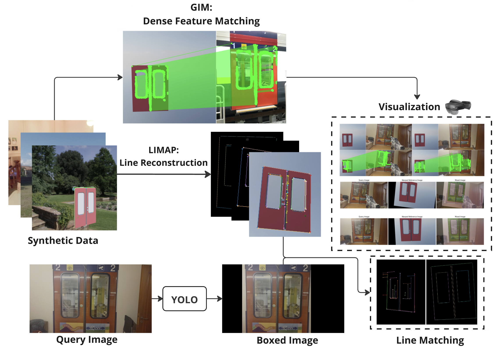

# Improving Object Pose Estimation with Line Features in MR: SBB Train Door Localization

This repository contains the code for the [Mixed Reality](https://cvg.ethz.ch/lectures/Mixed-Reality/) course project: Improving Object Pose Estimation with Line Features in MR. Specifically, it contains a feature matching and localization pipeline for SBB train door. This pipeline can utilize both [GIM (Generalizable Image Matcher)](https://github.com/xuelunshen/gim) and [LIMAP](https://github.com/cvg/limap) for pose estimation. Our webpage can be found here: https://yuk-haau.github.io/course-showcase/. 

### Main Contributions

- LIMAP reconstruction, feature matching, and localization based on both point and line features on SBB train door
- GIM feature matching with COLMAP dense feature point localization on SBB train door
- YOLO bounding box preprocessing for query image to remove line features outside the SBB train door

## Installation

Since this project is based on several well-maintained libraries, please follow the installation instructions of the respective projects for environment setup.

### System Requirements

Ubuntu == 22.04

### BlenderProc2

Blenderproc is used to generate synthetic datasets. The installation instructions can be found [here](https://dlr-rm.github.io/BlenderProc/). For this project, we additionally installed all HDRIs from polyhaven.com using `blenderproc download haven`.

### LIMAP

The installation instructions of LIMAP can be found under the [README](https://github.com/cvg/limap/blob/main/README.md) in their repository.

### GIM

The installation instruction of GIM can be found under the [README](https://github.com/xuelunshen/gim/blob/main/README.md) in their repository

